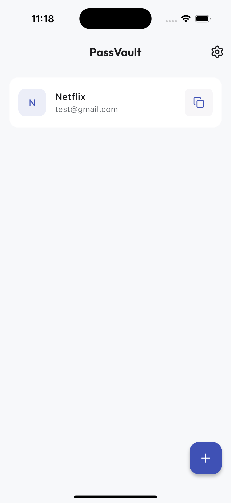
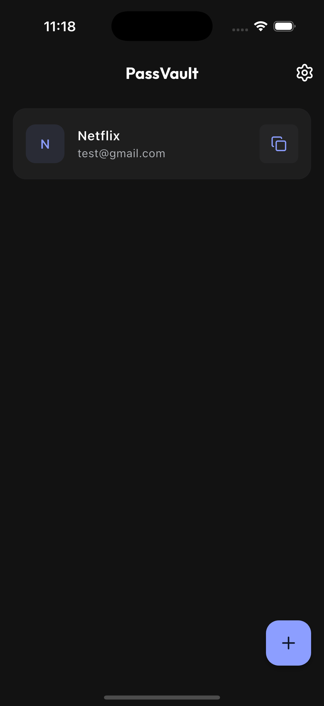
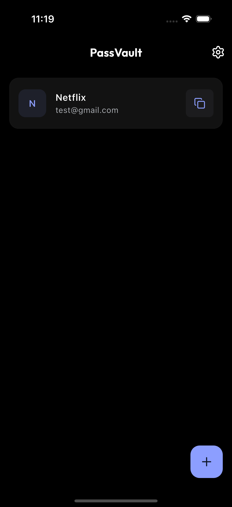

# PassVault 🔐

<p align="center">
  
</p>

<p align="center">
  <strong>A secure, offline-first password manager built with Flutter.</strong>
</p>

<p align="center">
  <a href="#features">Features</a> •
  <a href="#screenshots">Screenshots</a> •
  <a href="#installation">Installation</a> •
  <a href="#architecture">Architecture</a> •
  <a href="#tech-stack">Tech Stack</a>
</p>

---

## ✨ Features

### 🔒 Security First
- **AES-256 Encryption** - All passwords are encrypted locally using industry-standard encryption via Hive CE
- **Biometric Authentication** - Secure access with Face ID, Touch ID, or fingerprint
- **Offline-Only Storage** - Your data never leaves your device. No cloud, no sync, no risk

### 🎨 Modern Design
- **Material Design 3** - Beautiful, adaptive UI following the latest design guidelines
- **Multiple Themes** - Light, Dark, and AMOLED (Pure Black) modes
- **Smooth Animations** - Delightful micro-interactions and transitions

### ⚡ Powerful Features
- **Smart Password Generator** - Create strong passwords with customizable settings:
  - Adjustable length (12-64 characters)
  - Uppercase, lowercase, numbers, special characters
  - Exclude ambiguous characters (I, l, 1, O, 0)
- **Password Strength Indicator** - Real-time strength estimation
- **Import/Export** - Backup and restore data in JSON, CSV, or encrypted `.pvault` format
- **Quick Copy** - One-tap copy to clipboard
- **Search & Filter** - Quickly find your credentials

---

## 📱 Screenshots

| Light Mode | Dark Mode | AMOLED Mode |
|:----------:|:---------:|:-----------:|
|  |  |  |

---

## 🚀 Installation

### Prerequisites

- Flutter SDK `^3.38.5`
- Dart SDK `^3.10.4`
- Android Studio / Xcode
- VS Code (Recommended)

### Clone & Run

```bash
# Clone the repository
git clone https://github.com/dhruvanbhalara/passvault.git
cd passvault

# Install dependencies
flutter pub get

# Generate files (localization, DI, adapters)
make generate

# Run the app
make run_dev    # Development flavor
make run_prod   # Production flavor
```

### Build Variants

PassVault supports two flavors:

| Flavor | Description | Command |
|--------|-------------|---------|
| **dev** | Development build with debug tools | `flutter run --flavor dev` |
| **prod** | Production build, optimized | `flutter run --release --flavor prod` |

---

## 🏗️ Architecture

PassVault follows **Clean Architecture** principles with a feature-first structure:

```
lib/
├── app.dart                    # App entry & DI setup
├── main.dart                   # Main entry point
├── core/
│   ├── constants/              # App-wide constants
│   ├── di/                     # Dependency Injection (GetIt + Injectable)
│   ├── router/                 # GoRouter navigation
│   ├── services/               # Core services (Database, Biometrics)
│   └── theme/                  # App theming & design system
├── features/
│   ├── auth/                   # Authentication & biometrics
│   │   └── presentation/       # AuthBloc, AuthScreen
│   ├── home/                   # Dashboard & password list [NEW]
│   │   └── presentation/       # PasswordBloc, HomeScreen
│   ├── onboarding/             # First-run intro flow
│   │   └── presentation/       # OnboardingBloc, IntroScreen
│   ├── password_manager/       # Core password CRUD
│   │   ├── data/               # Repositories, data sources
│   │   ├── domain/             # Entities, use cases
│   │   └── presentation/       # AddEditScreen, AddEditPasswordBloc
│   └── settings/               # App preferences & export/import
│       └── presentation/       # SettingsScreen, ThemeCubit
└── l10n/                       # Localization files
```

### Dependency Flow

```
Presentation → Domain ← Data
     ↓           ↓        ↓
   BLoC      UseCases  Repositories
```

---

## 🛠️ Tech Stack

### Core Framework
| Package | Purpose |
|---------|---------|
| **Flutter** | Cross-platform UI framework |
| **Dart** | Programming language |

### Architecture & State
| Package | Purpose |
|---------|---------|
| `flutter_bloc` | State management (BLoC pattern) |
| `get_it` | Dependency injection container |
| `injectable` | Code generation for DI |
| `go_router` | Declarative navigation |
| `equatable` | Value equality for state objects |

### Storage & Security
| Package | Purpose |
|---------|---------|
| `hive_ce` | Local NoSQL database with encryption |
| `hive_ce_flutter` | Flutter bindings for Hive |
| `flutter_secure_storage` | Secure key storage (encryption keys) |
| `local_auth` | Biometric authentication |
| `pointycastle` | AES-256-GCM encryption for exports |

### UI & Design
| Package | Purpose |
|---------|---------|
| `google_fonts` | Custom typography |
| `lucide_icons_flutter` | Modern icon set |
| `lottie` | Vector animations |
| `animate_do` | Micro-animations |

### Password Logic
| Package | Purpose |
|---------|---------|
| `password_engine` | Password generation & strength estimation |
| `uuid` | Unique ID generation |

### Utilities
| Package | Purpose |
|---------|---------|
| `share_plus` | Native share functionality |
| `file_picker` | File selection for import |
| `csv` | CSV parsing for import/export |
| `path_provider` | Access to app directories |

---

## 📝 Configuration

### Makefile Commands

```bash
# Code Generation
make generate       # Generate l10n, DI, and Hive adapters

# Running
make run_dev        # Run development flavor
make run_prod       # Run production flavor

# Testing
make test           # Run all tests
make test_coverage  # Run tests with coverage

# Launcher Icons
make icons          # Generate icons for both flavors
make icons_dev      # Generate launcher icons (dev)
make icons_prod     # Generate launcher icons (prod)

# Git Hooks
make setup_hooks    # Configure git hooks (run once after clone)

# Quality
make lint           # Run Flutter analyze
make format         # Format Dart code
make clean          # Clean build artifacts
```

### 🪝 Git Hooks

PassVault uses Git hooks to maintain code quality. The hooks are stored in `.github/hooks/` and must be enabled after cloning.

**Setup (one-time):**
```bash
make setup_hooks
# or manually: git config core.hooksPath .github/hooks
```

| Hook | Trigger | Checks |
|------|---------|--------|
| **pre-commit** | Before each commit | `dart format` (auto-formatting) + `dart analyze` (static analysis) |
| **pre-push** | Before each push | `flutter test` (all tests must pass) |

> **Note:** If a hook fails, the git operation is aborted. Fix the issues and retry.

### Environment

The app uses flavor-based configuration:

| File | Purpose |
|------|---------|
| `flutter_launcher_icons-dev.yaml` | Dev app icon configuration |
| `flutter_launcher_icons-prod.yaml` | Prod app icon configuration |

---

## 🔐 Security

### Current Security Measures
| Measure | Status |
|---------|--------|
| Zero Network Access | ✅ Implemented |
| Biometric Gating | ✅ Implemented |
| Secure Key Storage | ✅ Implemented |
| Encrypted Storage (AES-256) | ✅ Implemented |
| Password-Protected Exports | ✅ Implemented |

> See [docs/ENCRYPTED_STORAGE.md](docs/ENCRYPTED_STORAGE.md) for technical details.

---

## 🌍 Localization

PassVault supports internationalization via Flutter's `intl` package.

- **Current Languages**: English (en)
- **Adding Languages**: Add a new `.arb` file in `lib/l10n/`

---

## 🧪 Testing

**128 tests** covering unit, BLoC, and widget layers.

```bash
# Run all tests
flutter test

# Run with coverage
flutter test --coverage
```

### Test Structure (mirrors lib/)

```
test/features/
├── auth/presentation/{bloc,screens}/
├── onboarding/presentation/{bloc,screens}/
├── password_manager/{domain,presentation}/
└── settings/presentation/screens/
```

| Category | Tests |
|----------|-------|
| Unit (UseCases, Entities) | 30 |
| BLoC | 13 |
| Widget/Screen | 36 |

---

## 📄 License

This project is licensed under the MIT License - see the [LICENSE](LICENSE) file for details.

---

## 🤝 Contributing

Contributions are welcome! Please read our contributing guidelines before submitting a PR.

1. Fork the repository
2. Create your feature branch (`git checkout -b feature/amazing-feature`)
3. Commit your changes (`git commit -m 'Add amazing feature'`)
4. Push to the branch (`git push origin feature/amazing-feature`)
5. Open a Pull Request

---

## 👨‍💻 Author

**Dhruvan Bhalara**

- GitHub: [@dhruvanbhalara](https://github.com/dhruvanbhalara)

---

<p align="center">
  Made with ❤️ and Flutter
</p>
