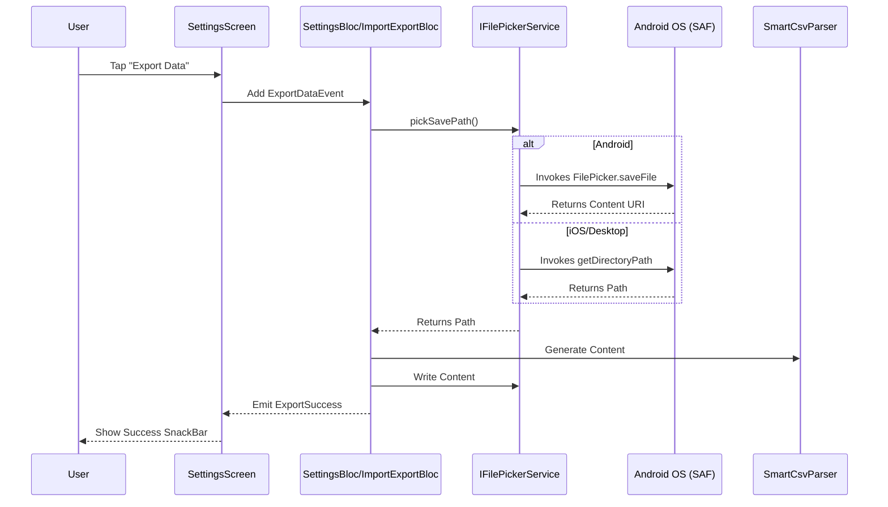

# Import/Export Documentation

This document serves as the single source of truth for the Import/Export feature in PassVault, covering background components, architectural flows, and user experience optimizations.

## 🌟 Overview
The Import/Export system allows seamless migration from various browsers and password managers into PassVault's encrypted storage. It is designed for maximum performance, direct-to-action workflows, and enterprise-grade data handling.

## 🏗️ Core Components

- **SmartCsvParser**: A robust parser that auto-detects 8+ industry-standard formats (Chrome, Firefox, Bitwarden, etc.) by analyzing headers and data patterns.
- **CsvExporter**: Generates standardized, portable CSV files with timestamped naming conventions.
- **IFilePickerService**: A Clean Architecture abstraction (Infrastructure layer) handling platform-specific file operations, including Android SAF (Storage Access Framework) compliance.
- **SettingsBloc**: Orchestrates the export flow by interacting with `IFilePickerService` and `DataService`.
- **ImportExportBloc (Singleton)**: A `@lazySingleton` state machine that manages transitions between resolution screens and repository persistence.

---

## 🚀 Advanced Architectural flows

### 1. Streamlined Import flow
We use a "Direct Picker" approach, bypassing intermediate screens to minimize user friction.

### 2. Android Scoped Storage Compliance (SAF)
To comply with modern Android security standards, we implement a strict **Storage Access Framework (SAF)** flow.
- **Problem**: Direct file access (`File('/dest').write`) throws `PathAccessException` on Android 10+.
- **Solution**: We use `FilePicker.saveFile` (wrapped in `FilePickerServiceImpl`) which invokes the native system picker.
- **Architectural Abstraction**: The UI (`SettingsScreen`) is completely unaware of this platform constraint. Is simply dispatches an event, and the `SettingsBloc` delegates the platform check to the `IFilePickerService`.

### 3. "Active Flow Parent" Logic
To prevent navigation breakage during asynchronous file picking, the `SettingsScreen` implements a robust Listener logic. 
- **The Challenge**: If a loading dialog is active, `isCurrent` route is false.
- **The Solution**: We track `_isLoadingShowing` to ensure the parent screen remains the active handler for navigation and snackbars.

### 4. Singleton Lifecycle Hotfix
We use `BlocProvider.value()` instead of the `create:` constructor in UI screens. This prevents the shared `ImportExportBloc` from being closed prematurely when a screen is disposed, allowing for multiple consecutive operations.

---

## 📂 Conflict Resolution

### Bulk Action System
When users face 50+ conflicts, manual selection is inefficient. The **Bulk Actions** header allows instant resolution:
- **Keep All Existing**: Fast-skip all imported duplicates.
- **Replace All**: Overwrite local entries with fresh import data.
- **Keep All Both**: Safely preserve every single record.

### Logic Flow
The UI propagates choice selections using the `copyWith` method on the `PasswordEntry` entity, ensuring immutable state updates before final persistence.

---

## 🔒 Security & Data Integrity

- **Encrypted Barrier**: All data transitions from plaintext CSV into AES-256-GCM encrypted Hive storage.
- **In-Memory Transformation**: Parsing and comparison happen entirely in memory; plaintext data is never written to temporary files.
- **Safety**: Export files are clearly marked as plaintext in the UI to prevent user accidents.

---

## 🧪 Verification Strategy

- **Widget Tests**: Located in `test/features/password_manager/presentation/screens/duplicate_resolution_screen_test.dart`.
- **Unit Tests**: Located in `test/features/password_manager/presentation/bloc/import_export_bloc_test.dart` and `test/features/settings/presentation/bloc/settings_bloc_test.dart`.
- **Service Tests**: Located in `test/core/services/file_picker_service_test.dart` to verify platform delegation.
- **Metric Verification**: Validates record counts, invalid row handling, and resolution success rates.
